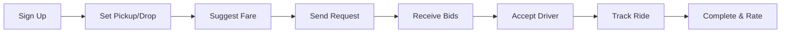
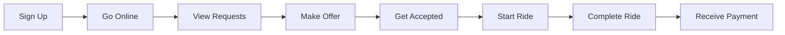

# 🚗 Chalo Chalein - Ride Hailing Platform

[](https://reactjs.org/)
[](https://www.typescriptlang.org/)
[](https://tailwindcss.com/)
[](https://supabase.com/)

A **production-ready** ride-hailing web application inspired by inDrive, featuring a unique reverse bidding system where passengers set their price and drivers compete with offers.


---

## ✨ Features

### 🎯 Core Functionality

- **Reverse Bidding System** - Passengers name their price, drivers make counter-offers
- **Multi-Role Support** - Passenger, Driver, and Admin dashboards
- **Real-Time Updates** - Live bid notifications and ride status tracking
- **In-App Chat** - Direct communication between passengers and drivers
- **Ride History** - Complete ride logs with filtering and search
- **Live Tracking** - Real-time ride progress monitoring
- **Secure Authentication** - JWT-based auth with Supabase

### 👥 User Roles

#### 🧍 Passenger Features
- Request rides with custom fare suggestions
- Receive multiple driver bids
- View driver ratings and vehicle details
- Accept/reject driver offers
- Track live ride progress
- Chat with assigned driver
- View complete ride history

#### 🚗 Driver Features
- Toggle online/offline status
- View available ride requests
- Make custom fare offers
- Accept passenger prices instantly
- Navigate to pickup/drop locations
- Manage active rides
- Track earnings and statistics
- View ride history and ratings

#### 🛠️ Admin Features
- Monitor all users and rides
- View platform statistics
- Manage user accounts
- Track total revenue
- Analyze ride patterns

---

## 🏗️ Architecture

### Tech Stack

**Frontend**
```
React 18.3.1
├── React Router 7 (routing)
├── Tailwind CSS 4 (styling)
├── Lucide React (icons)
├── Radix UI (components)
└── Supabase Client (backend integration)
```

**Backend**
```
Supabase
├── Edge Functions (Hono.js on Deno)
├── PostgreSQL (KV store)
├── Auth (JWT)
└── Real-time (polling-based)
```

### Project Structure

```
chalo-chalein/
├── src/
│   ├── app/
│   │   ├── components/       # Reusable UI components
│   │   │   └── ui/           # Shadcn UI components
│   │   ├── context/          # React Context providers
│   │   │   └── AuthContext.tsx
│   │   ├── pages/            # Route components
│   │   │   ├── Landing.tsx
│   │   │   ├── Login.tsx
│   │   │   ├── Signup.tsx
│   │   │   ├── PassengerDashboard.tsx
│   │   │   ├── DriverDashboard.tsx
│   │   │   ├── AdminDashboard.tsx
│   │   │   ├── RideTracking.tsx
│   │   │   ├── Chat.tsx
│   │   │   ├── RideHistory.tsx
│   │   │   ├── Profile.tsx
│   │   │   └── NotFound.tsx
│   │   ├── utils/
│   │   │   └── api.ts        # API client functions
│   │   ├── App.tsx           # Root component
│   │   └── routes.tsx        # Route configuration
│   └── styles/               # Global styles
├── supabase/
│   └── functions/
│       └── server/
│           ├── index.tsx     # Main server file
│           └── kv_store.tsx  # Database utilities
├── utils/
│   └── supabase/
│       └── info.tsx          # Supabase config
└── package.json
```

---

## 🚀 Quick Start

### Prerequisites

- Node.js 18+ installed
- A Supabase account (free tier)
- Modern web browser

### Installation

1. **Clone the repository** (or use Figma Make)

```bash
git clone https://github.com/yourusername/chalo-chalein.git
cd chalo-chalein
```

2. **Install dependencies**

```bash
npm install
```

3. **Run development server**

```bash
npm run dev
```

The app will be available at your local development URL.

---

## 🔧 Configuration

### Environment Setup

The app automatically reads Supabase configuration from the environment. No manual `.env` file needed in Figma Make.

For production deployment, set:

```env
VITE_SUPABASE_URL=your_supabase_url
VITE_SUPABASE_ANON_KEY=your_anon_key
```

---

## 📱 User Flows

### Passenger Journey



### Driver Journey



---

## 🎨 Design System

### Color Palette

```css
Primary:      #00C896  /* Teal Green - Trust & Movement */
Secondary:    #FF6F3C  /* Orange - Energy & Action */
Success:      #10B981  /* Green */
Warning:      #F59E0B  /* Amber */
Error:        #EF4444  /* Red */
Info:         #3B82F6  /* Blue */
```

### Typography

- **Font Family**: System fonts (SF Pro, Roboto, Inter)
- **Scale**: 12px → 14px → 16px → 18px → 24px → 36px → 48px

### Components

All UI components are built with:
- **Radix UI** - Accessible primitives
- **Tailwind CSS** - Utility-first styling
- **Shadcn UI** - Pre-built component patterns

---

## 🔐 Security

### Authentication Flow

1. User signs up with email/password
2. Supabase creates auth user + profile in KV store
3. Login returns JWT access token
4. Token sent with every API request
5. Server validates token before processing

### Security Measures

- ✅ JWT-based authentication
- ✅ Password hashing (bcrypt via Supabase)
- ✅ Protected API endpoints
- ✅ Input validation on server
- ✅ CORS enabled
- ✅ Service role key kept server-side only

---

## 📊 API Documentation

### Base URL

```
https://{projectId}.supabase.co/functions/v1/make-server-93f7752e
```

### Authentication Endpoints

**POST /auth/signup**
```json
{
  "email": "user@example.com",
  "password": "password123",
  "name": "John Doe",
  "phone": "+92 3XX XXXXXXX",
  "role": "passenger | driver | admin",
  "vehicleDetails": { /* if driver */ }
}
```

**GET /auth/profile**
- Headers: `Authorization: Bearer {token}`
- Returns: User profile data

### Ride Endpoints

**POST /rides/request** - Create ride request
**GET /rides/active** - Get all active rides
**GET /rides/:rideId** - Get specific ride
**POST /rides/:rideId/start** - Start ride (driver)
**POST /rides/:rideId/complete** - Complete ride (driver)
**POST /rides/:rideId/cancel** - Cancel ride
**GET /rides/history** - Get user's ride history

### Bid Endpoints

**POST /bids/create** - Create driver bid
**POST /bids/accept** - Accept bid (passenger)

### Driver Endpoints

**POST /driver/status** - Update online status
**GET /driver/earnings** - Get earnings data

### Message Endpoints

**POST /messages/send** - Send chat message
**GET /messages/:rideId** - Get ride messages

### Admin Endpoints

**GET /admin/users** - Get all users
**GET /admin/rides** - Get all rides

---

## 🧪 Testing

### Test Accounts

Create these test users for full functionality:

**Passenger:**
```
Email: passenger@test.com
Password: test123
```

**Driver:**
```
Email: driver@test.com
Password: test123
Vehicle Type: Car
Model: Honda City
License: KA-01-1234
```

**Admin:**
```
Email: admin@test.com
Password: admin123
(Manually set role to 'admin' after signup)
```

### Manual Testing Checklist

- [ ] User signup (passenger, driver)
- [ ] User login
- [ ] Passenger: Create ride request
- [ ] Driver: View ride requests
- [ ] Driver: Make bid offer
- [ ] Passenger: Accept bid
- [ ] Ride tracking page
- [ ] Chat functionality
- [ ] Complete ride
- [ ] View ride history
- [ ] Admin dashboard access

---

## 🚀 Deployment

See **[DEPLOYMENT_GUIDE.md](./DEPLOYMENT_GUIDE.md)** for detailed deployment instructions.

### Quick Deploy Options

1. **Figma Make** (Current) - Already live!
2. **Vercel** - `vercel --prod`
3. **Netlify** - Connect GitHub repo
4. **Custom** - Build and deploy anywhere

---

## 🛠️ Development

### Available Scripts

```bash
npm run dev      # Start development server
npm run build    # Build for production
npm run preview  # Preview production build
```

### Adding New Features

1. **Backend**: Add route in `/supabase/functions/server/index.tsx`
2. **API Client**: Add method in `/src/app/utils/api.ts`
3. **UI**: Create component in `/src/app/pages/`
4. **Route**: Add to `/src/app/routes.tsx`

---

## 🤝 Contributing

Contributions are welcome! Please follow these steps:

1. Fork the repository
2. Create a feature branch (`git checkout -b feature/amazing-feature`)
3. Commit changes (`git commit -m 'Add amazing feature'`)
4. Push to branch (`git push origin feature/amazing-feature`)
5. Open a Pull Request

---

## 📄 License

This project is licensed under the MIT License.

---

## 🙏 Acknowledgments

- Inspired by **inDrive's** innovative bidding model
- Built with **Supabase** backend platform
- UI components from **Shadcn UI**
- Icons from **Lucide React**

---

## 📞 Support & Contact

- **Issues**: Open an issue on GitHub
- **Email**: support@chalochalein.com (example)
- **Documentation**: See DEPLOYMENT_GUIDE.md

---

## 🎯 Roadmap

### Phase 1 (Current) ✅
- [x] User authentication
- [x] Ride request/bidding
- [x] Real-time updates (polling)
- [x] Chat system
- [x] Ride tracking
- [x] Admin panel

### Phase 2 (Future)
- [ ] Google Maps integration
- [ ] Payment gateway (Stripe/Razorpay)
- [ ] Push notifications
- [ ] Driver verification
- [ ] Rating system
- [ ] Ride scheduling
- [ ] Promo codes & referrals

### Phase 3 (Advanced)
- [ ] Multi-language support
- [ ] Native mobile apps
- [ ] AI-powered pricing
- [ ] Advanced analytics
- [ ] Delivery service mode
- [ ] Corporate accounts

---

## 📸 Screenshots

### Landing Page


### Passenger Dashboard


### Driver Dashboard


---

## 💡 Key Differentiators

### vs Traditional Ride-Hailing Apps

| Feature | Chalo Chalein | Uber/Lyft |
|---------|---------------|-----------|
| Pricing | Passenger sets price | Algorithm-based |
| Bidding | Driver can counter-offer | No negotiation |
| Transparency | Full visibility | Limited |
| Flexibility | High | Low |
| Commission | Can be lower | Fixed/high |

---

**Built with ❤️ for fair and transparent ride-hailing**

⭐ Star this repo if you found it helpful!
